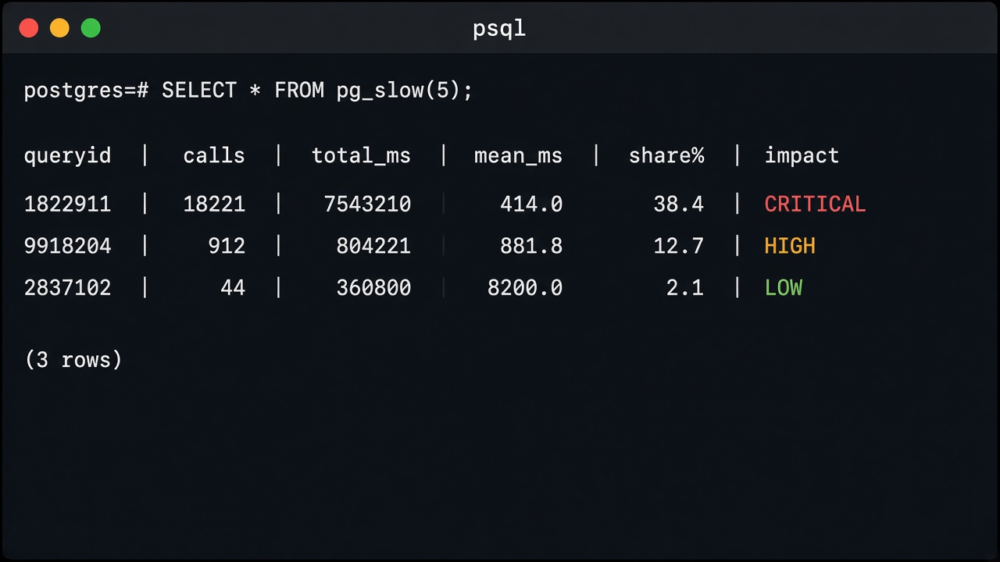
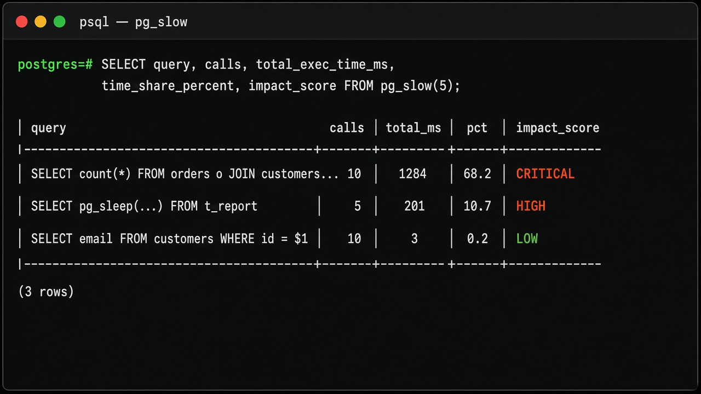

# pg_slow

[](LICENSE)
[](https://www.postgresql.org/)
[](sql/pg_slow--0.1.0.sql)
[](https://www.postgresql.org/docs/current/pgstatstatements.html)

> Show me which PostgreSQL queries are consuming most of my database execution time.

`pg_slow` is a tiny, production-friendly PostgreSQL extension. One function. No agents. No dashboards. Just a ranked view of what is spending your database time right now — powered by [`pg_stat_statements`](https://www.postgresql.org/docs/current/pgstatstatements.html).

<p align="center">
  
</p>

## What it does

Call `pg_slow()` and get the statements that consume the most **total** PostgreSQL execution time.

| You get | You do not get |
|---|---|
| Ranked list by `total_exec_time` | Historical monitoring / retention |
| Share of observed time (`time_share_percent`) | Grafana / Prometheus / HTTP API |
| Simple impact labels (CRITICAL → LOW) | Query rewriting or auto-tuning |
| Zero overhead until you call it | Background workers or collectors |

It is intentionally small: an experienced PostgreSQL developer can read the whole project in a few minutes.

## Installation

### 1. Enable `pg_stat_statements`

In `postgresql.conf` (normally required):

```conf
shared_preload_libraries = 'pg_stat_statements'
```

Restart PostgreSQL after changing that setting.

### 2. Install the extension files

From this repository (PGXS):

```sh
make
sudo make install
```

`pg_config` must be on your `PATH` (or pass `PG_CONFIG=/path/to/pg_config`).

### 3. Create the extensions

```sql
CREATE EXTENSION pg_stat_statements;
CREATE EXTENSION pg_slow;
```

## Usage

```sql
-- Top 10 queries with at least 5 calls (defaults)
SELECT * FROM pg_slow();

-- Top 20
SELECT * FROM pg_slow(20);

-- Top 20, ignore statements with fewer than 5 calls
SELECT * FROM pg_slow(20, 5);
```

### Parameters

| Argument | Meaning | Default |
|---|---|---|
| `result_limit` | Maximum rows returned | `10` |
| `min_calls` | Ignore statements below this call count | `5` |

### Return columns

| Column | Description |
|---|---|
| `queryid` | `pg_stat_statements` query id |
| `query` | Normalized query text |
| `calls` | Number of executions |
| `total_exec_time_ms` | Total execution time (ms) |
| `mean_exec_time_ms` | Mean execution time (ms) |
| `rows` | Total rows retrieved or affected |
| `time_share_percent` | Share of eligible total time |
| `impact_score` | `CRITICAL` / `HIGH` / `MEDIUM` / `LOW` |

Useful projections:

```sql
SELECT left(query, 80) AS query,
       calls,
       round(total_exec_time_ms::numeric, 1) AS total_ms,
       round(time_share_percent::numeric, 1) AS share_pct,
       impact_score
FROM pg_slow(10);
```

## Example

<p align="center">
  
</p>

Representative text output (columns abbreviated):

```text
queryid | calls | total_exec_time_ms | mean_exec_time_ms | time_share_percent | impact_score
--------+-------+--------------------+-------------------+--------------------+-------------
12345   | 18221 | 7543210            | 414.0             | 38.4               | CRITICAL
99182   | 912   | 804221             | 881.8             | 12.7               | HIGH
28371   | 44    | 360800             | 8200.0            | 2.1                | LOW
```

Notice the third row has a high **mean** time but a low **share**. `pg_slow` still ranks by total time first — rare expensive queries matter less than frequent ones that burn most of the budget.

## How ranking works

1. Filter `pg_stat_statements` to rows with `calls >= min_calls`.
2. Rank by `total_exec_time` **descending** (never primarily by average latency).
3. Compute each row’s share of the eligible total:

```text
time_share_percent =
  query_total_exec_time /
  total_exec_time_of_all_eligible_queries * 100
```

Division by zero (no eligible rows / zero total time) is safe: share is `0`, impact is `LOW`.

| Share of eligible total time | `impact_score` |
|---|---|
| ≥ 25% | CRITICAL |
| ≥ 10% | HIGH |
| ≥ 3% | MEDIUM |
| < 3% | LOW |

> **Important:** `impact_score` does **not** mean the query is bad. It only shows how much of the observed execution time that statement consumes.

Uses PostgreSQL 14+ column names (`total_exec_time`, `mean_exec_time`) — not the deprecated `total_time` / `mean_time`.

## Requirements

- PostgreSQL **14+**
- Extension **`pg_stat_statements`**
- `shared_preload_libraries` normally includes `pg_stat_statements`

## Limitations

- `pg_slow` analyzes the **current** `pg_stat_statements` statistics window. Statistics may have been reset manually or after restart depending on PostgreSQL configuration, so this is **not** historical monitoring.
- Only statements tracked by `pg_stat_statements` are visible (see `pg_stat_statements.track` and related settings).
- Non-superusers see the same limited view of `pg_stat_statements` that PostgreSQL already enforces.
- The function is read-only: it never executes captured SQL, never changes plans, never kills sessions, and never starts background workers.
- Runtime overhead is effectively zero unless you call `pg_slow()` itself.

## Development

```sh
make
make install
```

Regression tests need a running PostgreSQL with `pg_stat_statements` preloaded (see [`test/pg_slow.conf`](test/pg_slow.conf)):

```sh
make installcheck
```

Layout:

```text
pg_slow/
├── LICENSE
├── Makefile
├── README.md
├── pg_slow.control
├── sql/pg_slow--0.1.0.sql   # extension
├── sql/pg_slow.sql          # regression tests
├── expected/pg_slow.out
├── test/pg_slow.conf
└── assets/                  # README screenshots
```

## Contributing

Bug reports and small, focused improvements are welcome. Please keep the project intentionally minimal — this is a utility, not a monitoring platform.

See [CONTRIBUTING.md](CONTRIBUTING.md).

## License

Apache License 2.0. See [LICENSE](LICENSE).
